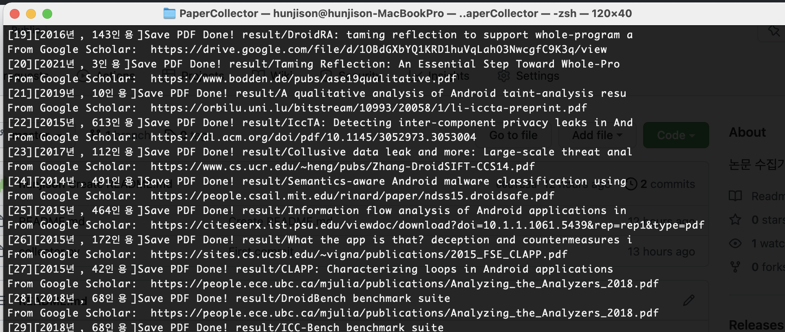
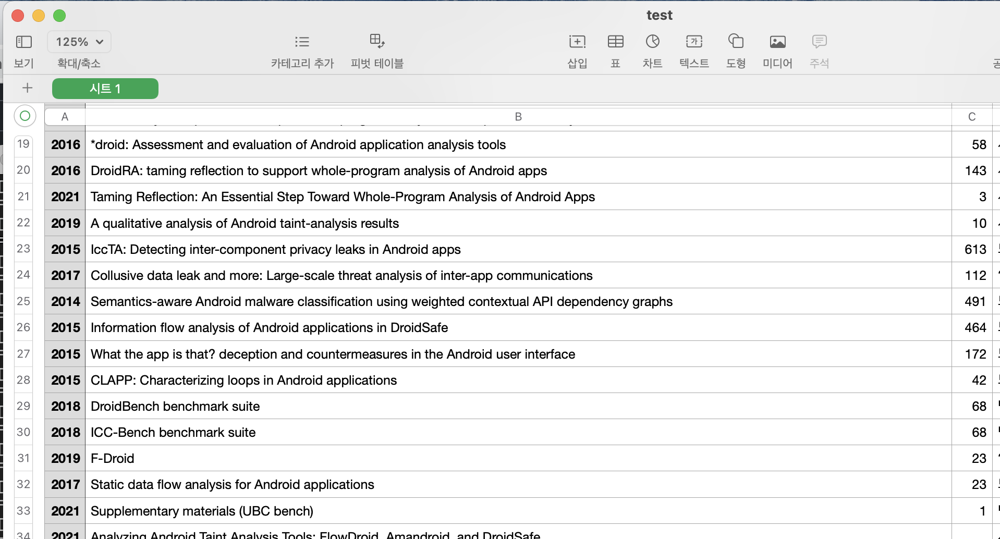

# Papercollector.py
논문 수집을 위한 코드

## 목표
csv의 이름(1번 열)을 가지고,
1) scholar.google.com 과 sci-hub.se 사이트로부터 논문을 다운로드
2) csv 파일에서 연도, 인용 수 필드 채우기

```text
input csv 예시
---------------------------------------------------
연도         |   이름               |   인용수
---------------------------------------------------
            |  FlowDroid ..       |     
---------------------------------------------------
```

## 사용자 입력
1) request header : 구글 탐지 우회
2) csv 파일 경로
3) .py 파일과 동일 경로에 /result 폴더 생성해주어야 함.

## 결과


